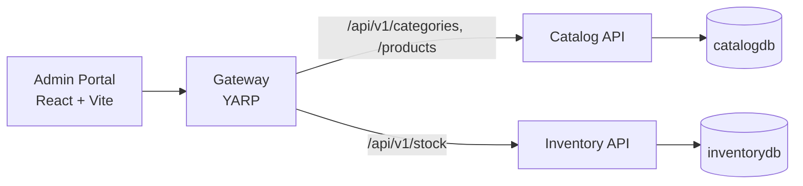

# HappyBoxx

Warehouse platform for selling and delivering vegetables, fruits and food containers.

- **Admin portal**: manage categories, products and stock. *(in progress)*
- **Buyer storefront**: browse items and place orders. *(planned)*

See [docs/CODING_STANDARDS.md](docs/CODING_STANDARDS.md) for conventions.

## Architecture



The whole system is orchestrated locally by **.NET Aspire**, which provides service discovery, health checks and an OpenTelemetry dashboard.

| Project | Purpose |
|---|---|
| `src/Aspire/HappyBoxx.AppHost` | Starts everything locally |
| `src/Aspire/HappyBoxx.ServiceDefaults` | Telemetry, health, resilience, discovery |
| `src/BuildingBlocks/HappyBoxx.BuildingBlocks` | Result/Error, endpoint discovery, validation filter, paging, auditing |
| `src/Gateway/HappyBoxx.Gateway` | Single entry point for front-ends |
| `src/Services/Catalog` | Categories and products |
| `src/Services/Inventory` | Stock levels and adjustments |
| `src/Web/admin-portal` | Admin SPA |

## Prerequisites

- .NET SDK 10 (see `global.json`)
- Node.js 20.19+ (or 22.12+)
- SQL Server LocalDB (`(localdb)\MSSQLLocalDB`), or update the connection strings in `src/Aspire/HappyBoxx.AppHost/appsettings.Development.json`

## Run

```powershell
dotnet tool restore
dotnet run --project src/Aspire/HappyBoxx.AppHost
```

Open the dashboard link printed in the console. From there you can reach the admin portal, the gateway, and each API's Scalar docs at `/scalar`. In Development, databases are created, migrated and seeded on startup.

> If your machine's security policy blocks unsigned `.exe` files, set `$env:HAPPYBOXX_NO_APPHOST='true'` before building or running. The apps then run through `dotnet <dll>`.

## Test

```powershell
dotnet test --solution HappyBoxx.slnx
cd src/Web/admin-portal; npm test; npm run lint
```

## Add a migration

```powershell
dotnet ef migrations add <Name> -p src/Services/Catalog/HappyBoxx.Catalog.Api -o Infrastructure/Persistence/Migrations
```
